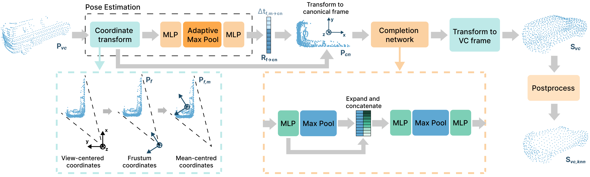

# Viewer-centred Completion Network (VCN)

This is code for the viewer-centred completion network, VCN used in [SEE-VCN](https://github.com/darrenjkt/SEE-VCN). 



## Install
```
pip install -e . --user
```

## Usage
We provide a [Demo notebook](https://github.com/darrenjkt/VCN/blob/main/demo.ipynb) with some demo data for quickstart.

### Training
```
# Use DistributedDataParallel (DDP)
bash ./scripts/dist_train.sh <NUM_GPU> <port> \
    --config <config> \
    --exp_name <name> \
    [--resume] \
    [--start_ckpts <path>] \
    [--val_freq <int>]
# or just use DataParallel (DP)
bash ./scripts/train.sh <GPUIDS> \
    --config <config> \
    --exp_name <name> \
    [--resume] \
    [--start_ckpts <path>] \
    [--val_freq <int>]
```
For example: 
```
# Train a model with 2 gpus
CUDA_VISIBLE_DEVICES=0,1 bash ./scripts/dist_train.sh 2 13232 \
    --config ./cfgs/VCN_models/VCN_VC.yaml \
    --exp_name exp01
    
# Resume model training
CUDA_VISIBLE_DEVICES=0,1 bash ./scripts/dist_train.sh 2 13232 \
    --config ./cfgs/VCN_models/VCN_VC.yaml \
    --exp_name exp01 --resume
```

### Testing
```
bash ./scripts/test.sh 0 \
    --ckpts ./model_zoo/VCN_VC.pth \
    --config ./cfgs/VCN_models/VCN_VC.yaml \
    --exp_name exp01
```

### Acknowledgements
Our code is built on the repository of [PoinTr](https://github.com/yuxumin/PoinTr).
